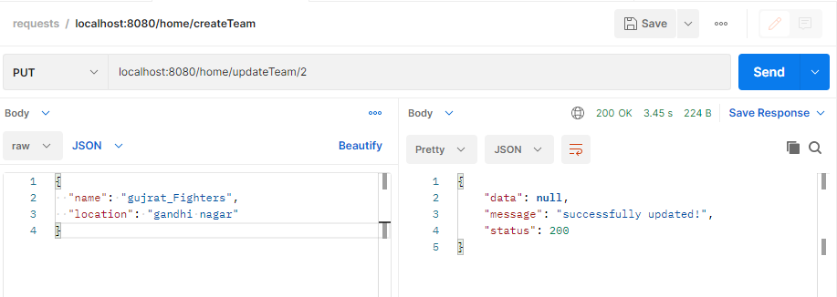
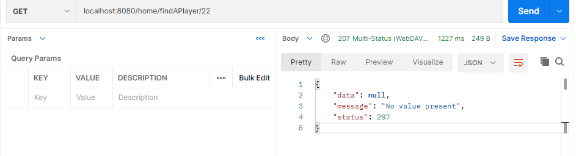

# Football Tournament Rest API

---

> ## Steps to Setup :-

1. ### Clone the application -

   :point_right: [https://github.com/shubham10soni/Football-Tournament.git](https://github.com/shubham10soni/Football-Tournament.git)

2. ### Create Mysql database -

```sql
    create database footballtournament;
```

3. ### Change mysql username and password as per your installation

- Open -

```path
    src\main\resources\application.properties
```

- Change <mark style=background:#a4a7ab!important>**spring.datasource.username**</mark> and <mark style=background:#a4a7ab!important>
  spring.datasource.password </mark> as per your mysql installation.

4. Run the app using maven -

```
mvn spring-boot:run
```

---

> ## Versions-

- ### Spring Tool Suite 4

* ### JavaSE-17
* ### Swagger 2.0
* ### MySql 8.0

---

> ## MySql Configuration:-

```
#changing the server port
server.port=8080

#database configuration:mysql
spring.datasource.url=jdbc:mysql://localhost:3306/footballtournament
spring.datasource.username=root
spring.datasource.password=12345
spring.datasource.driver-class-name=com.mysql.cj.jdbc.Driver
```

---

> ## Swagger :-

```url
http://localhost:8080/swagger-ui/
```

:red_circle: 8080 is the port on which the Tomcat server was started in my system.You can check your port number,and write url accordingly.:+1:

- ### Swagger UI :-

  

---

> ## Dependencies :-

```html
<!--Dependency for swagger-->
<dependency>
  <groupId>io.springfox</groupId>
  <artifactId>springfox-boot-starter</artifactId>
  <version>3.0.0</version>
</dependency>

<!--Dependency for jpa-->
<dependency>
  <groupId>org.springframework.boot</groupId>
  <artifactId>spring-boot-starter-data-jpa</artifactId>
</dependency>

<!--Spring web dependency-->
<dependency>
  <groupId>org.springframework.boot</groupId>
  <artifactId>spring-boot-starter-web</artifactId>
</dependency>

<!--mysql java connector dependency-->
<dependency>
  <groupId>mysql</groupId>
  <artifactId>mysql-connector-java</artifactId>
  <scope>runtime</scope>
</dependency>

<!--Spring boot test dependency-->
<dependency>
  <groupId>org.springframework.boot</groupId>
  <artifactId>spring-boot-starter-test</artifactId>
  <scope>test</scope>
</dependency>
```

---

> ## Models :-

### 1. Teams

```
{
created_at	string($date-time)
id	integer($int64)
location	string
name	string
updated_at	string($date-time)
}
```

### 2. Players

```
{
age	integer($int32)
created_at	string($date-time)
id	integer($int64)
name	string
team_id	integer($int64)
updated_at	string($date-time)
}
```

- Unidirectional one to many relationship

  - **Primary key**- id (Model-Teams)
  - **Foreign key**- team_id (Model-Players)

---

> ## Endpoints :-

| METHOD | URL                                  | DESCRIPTION                                                        |
| ------ | ------------------------------------ | ------------------------------------------------------------------ |
| POST   | home/createTeam                      | Create a team.                                                     |
| POST   | home/createPlayer                    | Create a player.                                                   |
| DELETE | home/deleteTeam/{id}                 | Delete a team using its unique id.                                 |
| DELETE | home/deletePlayer/{id}               | Delete a player using its unique id.                               |
| DELETE | home/deletePlayersByTeamId/{team_id} | Delete all the players playing in a perticular Team using team id. |
| GET    | home/findATeam/{id}                  | Find a team using team id.                                         |
| GET    | home/findAPlayer/{id}                | Find a player using player id.                                     |
| GET    | home/listTeams                       | Get list of Teams with pagination.                                 |
| GET    | home/listPlayers                     | Get list of players with pagination.                               |
| GET    | home/teamByPlayerId/{id}             | Find the team of a player using player id.                         |
| GET    | home/playersByTeamId/{team_id}       | Find all the players playing in a perticular Team using team id.   |
| PUT    | home/updateTeam/{id}                 | Update team info. using its id.                                    |
| PUT    | home/updatePlayer/{id}               | Update player info. using its id.                                  |

---

> ## Custom json response of endpoints:-

- ### Format-

```
{
  "data": [],
  "message": "message",
  "status": <http-status>
}
```

- ### For Example :-

```json
{
  "data": {
    "id": 7,
    "name": "jatin sharma",
    "age": 25,
    "created_at": "2022-01-23T23:25:37.435+00:00",
    "updated_at": "2022-01-25T12:59:35.004+00:00",
    "team_id": 2
  },
  "message": "successfully retrived!",
  "status": 200
}
```

---

> ## Note :-

Since in this project we are dealing with _date_ and _time_,it would be cumbersome for us to write **json** raw request body while testing Endpoints like <mark style=background:#f5c85f!important> **home/createPlayer** </mark> , <mark style=background:#f55f5f!important> **home/createTeam** </mark> , <mark style=background:#7fc756!important> **home/updateTeam/{id}** </mark> ,or <mark style=background:#5c97d1!important> **home/updatePlayer/{id}** </mark>. To solve this problem,I have used <mark style=background:#a4a7ab!important> **@PrePersist** </mark> and <mark style=background:#a4a7ab!important> **@PreUpdate** </mark> annotations to add lifecycle events in order to add date and time automatically, which implies that there is no need to specify parameters like <mark style=background:#a4a7ab!important> **created_at**</mark> and <mark style=background:#a4a7ab!important> **updated_at**</mark> in the raw json request body.

- Also,since <mark style=background:#a4a7ab!important>"id"</mark> is **primary key** in both the models, therefore we dont have to specify id parameter during _'create'_ operations because using <mark style=background:#a4a7ab!important> @GeneratedValue(strategy = GenerationType.AUTO)</mark> annotation
  unique **id**'s will be generated and stored automatically !:smile:

* Use these example raw json request bodies for _create_ operation:

For **Teams** Model -

```json
{
  "location": "Enter string value",
  "name": "Enter string value"
}
```

For **Players** Model -

```
{
  "age": Enter integer value ,
  "name": "Enter string value",
  "team_id": Enter integer value
}
```

:point_right: **No need to specify other parameters,this will work perfectly**.:smile:

- For Update operations just follow following steps. :point_down:

  1. For Example,If you want to update player with player **Id** = 5 use <mark style=background:#a4a7ab!important>home/findAPlayer/5</mark>.and copy the result.

```
{
  "id": 5,
  "name": "shubham yadav",
  "age": 24,
  "created_at": "2022-01-23T23:24:03.726+00:00",
  "updated_at": "2022-01-24T13:40:03.189+00:00",
  "team_id": 2
}
```

2. Now use <mark style=background:#a4a7ab!important>home/updatePlayer/5</mark> and paste the copied result (from **Step 1**) in the raw json request body text area in **POSTMAN**.Remove the auto generated Fields like(**id**,**created_at**,**updated_at**).

```
{
  "name": "shubham yadav",
  "age": 24,
  "team_id": 2
}
```

3. Change the value of only those parameters which you want to update.Now click on **Send** button!

```
{
  "name": "shubham singh",
  "age": 24,
  "team_id": 3
}
```

:tada: Player is Succesfully updated! You can confirm it by using <mark style=background:#a4a7ab!important>home/findAPlayer/5</mark>.

Result :

```json
{
  "data": null,
  "message": "successfully updated!",
  "status": 200
}
```

---

> ## Testing :-

**Read the above note before testing**

### 1. Testing-<mark style=background:#a4a7ab!important>**home/createTeam**</mark> Endpoint :-

- This will create a new Team.

- Select **POST** method on **POSTMAN**.

* Pass the raw json request body in the text area

Example json request body-

```json
{
  "location": "Punjab_Sikandars",
  "name": "Amritsar"
}
```

:white_check_mark:**id , created_at and updated_at fields will be automatically generated.**

- ### Test Results :-


---

### 2. Testing-<mark style=background:#a4a7ab!important>**home/createPlayer**</mark> Endpoint :-

- This will create a new player.

- Select **POST** method on **POSTMAN**.

* Pass the raw json request body in the text area

Example json request body-

```json
{
  "age": 24,
  "name": "Aman singh",
  "team_id": 1
}
```

:white_check_mark:**id , created_at and updated_at fields will be automatically generated.**

- ### Test Results :-


---

### 3. Testing-<mark style=background:#a4a7ab!important>**home/home/deleteTeam/{id}**</mark> Endpoint :-

- This will delete a team using its unique id.

- Select **DELETE** method on **POSTMAN**.

* eg, You want to delete a team whose id is **4**

  just use url like this in **POSTMAN** and click **send** button.

```url
localhost:8080/home/deleteTeam/4
```

:red_circle: 8080 is the port on which the Tomcat server was started in my system.You can check your port number,and write url accordingly.:+1:

:red_circle:Since we have one to many unidirectional relationship between **team** model and **player** model,so in order to remove a team,You have to remove all the players playing for that
perticular team to maintain **referential integrity**.

:white_check_mark:To solve this problem just use <mark style=background:#a4a7ab!important>home/deletePlayersByTeamId/{team_id}</mark>:smile::+1:

:white_check_mark:Confirm the result using <mark style=background:#a4a7ab!important>home/findATeam/{id}</mark>

- ### Test Results :-


---

### 4. Testing-<mark style=background:#a4a7ab!important>**home/home/deletePlayer/{id}**</mark> Endpoint :-

- This will delete a Player using its unique id.

- Select **DELETE** method on **POSTMAN**.

* eg, You want to delete a Player whose id is **5**

  just use url like this in **POSTMAN** and click **send** button.

```url
localhost:8080/home/deletePlayer/5
```

:red_circle: 8080 is the port on which the Tomcat server was started in my system.You can check your port number,and write url accordingly.:+1:

- ### Test Results :-


:white_check_mark:Confirm the result using <mark style=background:#a4a7ab!important>home/findAPlayer/{id}</mark>

---

### 5. Testing-<mark style=background:#a4a7ab!important>**home/deletePlayersByTeamId/{team_id}**</mark> Endpoint :-

- This will delete all the players playing in a perticular Team using team id.

- Select **DELETE** method on **POSTMAN**.

* eg, You want to delete all the Players playing for a perticular team (with team id = **35**)

  just use url like this in **POSTMAN** and click **send** button.

```url
localhost:8080/home/deletePlayersByTeamId/35
```

:red_circle: 8080 is the port on which the Tomcat server was started in my system.You can check your port number,and write url accordingly.:+1:

- ### Test Results :-


:white_check_mark:Confirm the result using <mark style=background:#a4a7ab!important>/home/listPlayers</mark>
or <mark style=background:#a4a7ab!important>home/playersByTeamId/{team_id}</mark>

---

### 6. Testing-<mark style=background:#a4a7ab!important>**home/findATeam/{id}**</mark> Endpoint :-

- This will find a team using team id.

- Select **GET** method on **POSTMAN**.

* eg, You want to find a team using team id (team id = **2**)

  just use url like this in **POSTMAN** and click **send** button.

```url
localhost:8080/home/findATeam/2
```

:red_circle: 8080 is the port on which the Tomcat server was started in my system.You can check your port number,and write url accordingly.:+1:

- ### Test Results :-


---

### 7. Testing-<mark style=background:#a4a7ab!important>**home/findAPlayer/{id}**</mark> Endpoint :-

- This will find a Player using Player id.

- Select **GET** method on **POSTMAN**.

* eg, You want to find a Player using Player id (id = **7**)

  just use url like this in **POSTMAN** and click **send** button.

```
localhost:8080/home/findAPlayer/7
```

:red_circle: 8080 is the port on which the Tomcat server was started in my system.You can check your port number,and write url accordingly.:+1:

- ### Test Results :-


---

### 8. Testing-<mark style=background:#a4a7ab!important>**home/listTeams**</mark> Endpoint :-

- Get list of Teams with pagination.

- Select **GET** method on **POSTMAN**.

* eg, You want to get list of Teams.

  just use url like this in **POSTMAN** and click **send** button.

```
localhost:8080/home/listTeams
```

:red_circle: 8080 is the port on which the Tomcat server was started in my system.You can check your port number,and write url accordingly.:+1:

- If you want see results with <mark style=background:#a4a7ab!important>**pagination**</mark> then specify page number and size ( i.e., number of records per page) in the url.

eg,

```
localhost:8080/home/listTeams?page=0&size=2
```

here , page number = 0 & size = 2

- If you will not specify page number and size values then API will return result according to default values i.e.,
  page number= 0 & size = 3

* ### Test Results :-


```json
{
  "data": {
    "content": [
      {
        "id": 2,
        "name": "gujrat_kings",
        "location": "gandhi nagar",
        "created_at": "2022-01-23T23:16:48.909+00:00",
        "updated_at": "2022-01-23T23:16:48.909+00:00"
      },
      {
        "id": 3,
        "name": "up_warriors",
        "location": "kanpur",
        "created_at": "2022-01-23T23:17:45.039+00:00",
        "updated_at": "2022-01-23T23:17:45.039+00:00"
      }
    ],
    "pageable": {
      "sort": {
        "empty": true,
        "sorted": false,
        "unsorted": true
      },
      "offset": 0,
      "pageSize": 2,
      "pageNumber": 0,
      "unpaged": false,
      "paged": true
    },
    "last": false,
    "totalPages": 3,
    "totalElements": 5,
    "size": 2,
    "number": 0,
    "sort": {
      "empty": true,
      "sorted": false,
      "unsorted": true
    },
    "first": true,
    "numberOfElements": 2,
    "empty": false
  },
  "message": "successfully retrived!",
  "status": 200
}
```

---

### 9. Testing-<mark style=background:#a4a7ab!important>**home/listPlayers**</mark> Endpoint :-

- Get list of Players with pagination.

- Select **GET** method on **POSTMAN**.

* eg, You want to get list of Players.

  just use url like this in **POSTMAN** and click **send** button.

```
localhost:8080/home/listPlayers
```

:red_circle: 8080 is the port on which the Tomcat server was started in my system.You can check your port number,and write url accordingly.:+1:

- If you want see results with <mark style=background:#a4a7ab!important>**pagination**</mark> then specify page number and size ( i.e., number of records per page) in the url.

eg,

```
localhost:8080/home/listPlayers?page=0&size=2
```

here , page number = 0 & size = 2

- If you will not specify page number and size values then API will return result according to default values i.e.,
  page number= 0 & size = 3

* ### Test Results :-


```json
{
  "data": {
    "content": [
      {
        "id": 7,
        "name": "jatin verma",
        "age": 25,
        "created_at": "2022-01-23T23:25:37.435+00:00",
        "updated_at": "2022-01-23T23:25:37.435+00:00",
        "team_id": 2
      },
      {
        "id": 8,
        "name": "akshay verma",
        "age": 25,
        "created_at": "2022-01-23T23:25:57.570+00:00",
        "updated_at": "2022-01-23T23:25:57.570+00:00",
        "team_id": 3
      }
    ],
    "pageable": {
      "sort": {
        "empty": true,
        "sorted": false,
        "unsorted": true
      },
      "offset": 0,
      "pageSize": 2,
      "pageNumber": 0,
      "unpaged": false,
      "paged": true
    },
    "last": false,
    "totalPages": 3,
    "totalElements": 5,
    "size": 2,
    "number": 0,
    "sort": {
      "empty": true,
      "sorted": false,
      "unsorted": true
    },
    "first": true,
    "numberOfElements": 2,
    "empty": false
  },
  "message": "successfully retrived!",
  "status": 200
}
```

---

### 10. Testing-<mark style=background:#a4a7ab!important>**teamByPlayerId/{id}**</mark> Endpoint :-

- This will find the team of a player using player id.

- Select **GET** method on **POSTMAN**.

* eg, You want to find the team of a player using player id.
  (id = **7**)

  just use url like this in **POSTMAN** and click **send** button.

```url
localhost:8080/home/teamByPlayerId/7
```

:red_circle: 8080 is the port on which the Tomcat server was started in my system.You can check your port number,and write url accordingly.:+1:

- ### Test Results :-


---

### 11. Testing-<mark style=background:#a4a7ab!important>**home/playersByTeamId/{team_id}**</mark> Endpoint :-

- This will find all the players playing in a perticular Team using team id.

- Select **GET** method on **POSTMAN**.

* eg, You want to find find all the players playing in a perticular Team using team id.
  (team_id = **2**)

  just use url like this in **POSTMAN** and click **send** button.

```url
localhost:8080/home/playersByTeamId/2
```

:red_circle: 8080 is the port on which the Tomcat server was started in my system.You can check your port number,and write url accordingly.:+1:

- ### Test Results :-


```json
{
  "data": [
    {
      "id": 7,
      "name": "jatin verma",
      "age": 25,
      "created_at": "2022-01-23T23:25:37.435+00:00",
      "updated_at": "2022-01-23T23:25:37.435+00:00",
      "team_id": 2
    },
    {
      "id": 10,
      "name": "pranshu saxena",
      "age": 27,
      "created_at": "2022-01-23T23:26:36.315+00:00",
      "updated_at": "2022-01-23T23:33:39.695+00:00",
      "team_id": 2
    }
  ],
  "message": "successfully retrived!",
  "status": 200
}
```

---

### :warning:Please read this note before testing update operation :point_right: [here](#note--)

### 12. Testing-<mark style=background:#a4a7ab!important>**home/updateTeam/{id}**</mark> Endpoint :-

- This will update team info. using its id.

- Select **PUT** method on **POSTMAN**.

* eg, You want to update team info. using its id. (team id = **2**)

* just follow following steps. :point_down:

1. For Example,If you want to update a team with team_id (**Id** = 2) use <mark style=background:#a4a7ab!important>home/findATeam/2</mark>.and copy the result.

```json
{
  "id": 2,
  "name": "gujrat_kings",
  "location": "gandhi nagar",
  "created_at": "2022-01-23T23:16:48.909+00:00",
  "updated_at": "2022-01-23T23:16:48.909+00:00"
}
```

2. Now use <mark style=background:#a4a7ab!important>home/updateTeam/2</mark> and paste the copied result (from **Step 1**) in the raw json request body text area in **POSTMAN**.Remove the auto generated Fields like(**id**,**created_at**,**updated_at**).

```url
localhost:8080/home/updateTeam/2
```

:red_circle: 8080 is the port on which the Tomcat server was started in my system.You can check your port number,and write url accordingly.:+1:

```json
{
  "name": "gujrat_kings",
  "location": "gandhi nagar"
}
```

3. Change the value of only those parameters which you want to update.Now click on **Send** button!

```json
{
  "name": "gujrat_Fighters",
  "location": "gandhi nagar"
}
```

:tada: Team is Succesfully updated! You can confirm it by using <mark style=background:#a4a7ab!important>home/findATeam/2</mark>.

- ### Test Results :-



:white_check_mark:Confirm the result using <mark style=background:#a4a7ab!important>/home/listTeams</mark>
or <mark style=background:#a4a7ab!important>home/findATeam/{team_id}</mark>

---

### 13. Testing-<mark style=background:#a4a7ab!important>**home/updatePlayer/{id}**</mark> Endpoint :-

- This will update Player info. using its id.

- Select **PUT** method on **POSTMAN**.

* eg, You want to update Player info. using its id. (id = **7**)

* just follow following steps. :point_down:

1. For Example,If you want to update a player with id (**Id** = 7) use <mark style=background:#a4a7ab!important>home/findAPlayer/7</mark>.and copy the result.

```json
{
  "id": 7,
  "name": "jatin verma",
  "age": 25,
  "created_at": "2022-01-23T23:25:37.435+00:00",
  "updated_at": "2022-01-23T23:25:37.435+00:00",
  "team_id": 2
}
```

2. Now use <mark style=background:#a4a7ab!important>home/updatePlayer/7</mark> and paste the copied result (from **Step 1**) in the raw json request body text area in **POSTMAN**.Remove the auto generated Fields like(**id**,**created_at**,**updated_at**).

```url
localhost:8080/home/updatePlayer/7
```

:red_circle: 8080 is the port on which the Tomcat server was started in my system.You can check your port number,and write url accordingly.:+1:

```json
{
  "name": "jatin verma",
  "age": 25,
  "team_id": 2
}
```

3. Change the value of only those parameters which you want to update.Now click on **Send** button!

```json
{
  "name": "jatin sharma",
  "age": 25,
  "team_id": 2
}
```

:tada: Player is Succesfully updated! You can confirm it by using <mark style=background:#a4a7ab!important>home/findAPlayer/7</mark>.

- ### Test Results :-


:white_check_mark:Confirm the result using <mark style=background:#a4a7ab!important>/home/listPlayers</mark>
or <mark style=background:#a4a7ab!important>home/findAPlayer/{id}</mark>

---

> ## Exception Handling :-

### In this project,I have used both types of exception handling i.e., exception handling on local level with the use of **try-catch** block and on global level using  *@ControllerAdvice* annotation.See some of the test results-

1. ### Don't worry if you have used a wrong request method-


2. ### Don't worry if the ID you entered doesn't exist-



3. ### If you're on the wrong page or the table has no value, don't worry-


---
